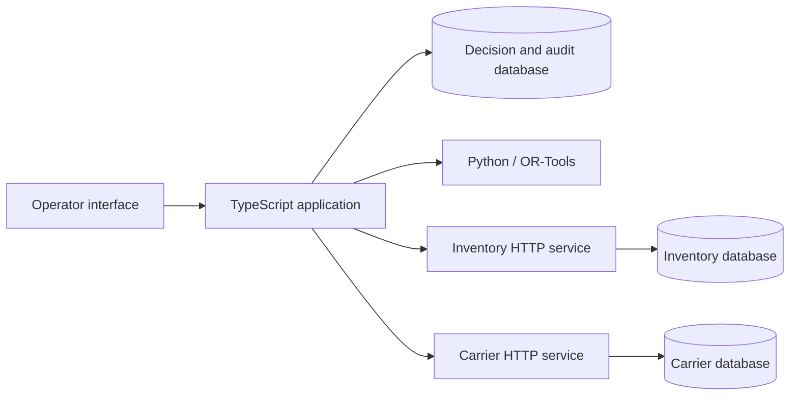

# Replan

**Recover an approved operation when the world changes halfway through it.**

[](https://github.com/maximilliangrand/replan/actions/workflows/ci.yml)

A supplier delay threatens three factory repairs. Replan finds feasible spare-part transfers, asks an operator to approve the tradeoffs, then executes against independently stateful inventory and carrier services.

The interesting part comes next: the carrier commits a shipment but its reply disappears. Another customer consumes stock needed by the remaining plan. Replan reconciles the shipment, preserves completed work, rejects stale reservations, and asks for approval of a feasible replacement.

**A synthetic operational application with real persistence, HTTP failures, and process restarts. A temporary private Railway pilot was tested, then intentionally taken offline on 2026-09-23. Inventory and carrier execution remain simulated. No live shipments or customer data.**

## Run it

With Docker Compose:

```sh
git clone https://github.com/maximilliangrand/replan.git
cd replan
docker compose up --build
```

Open **http://127.0.0.1:4310**. The first build downloads Node and Python dependencies. PostgreSQL data survives service restarts. `docker compose down` stops services and retains the database volume.

For local development, install **Node 22.22.2+, 24.15+, or 26+**, **uv**, and **PostgreSQL 16+** with `initdb`, `pg_ctl`, `psql`, and `createdb` on PATH:

```sh
npm run dev
```

Open **http://127.0.0.1:4317**. The runner installs locked dependencies, prepares Python 3.12, creates its own PostgreSQL cluster under `.local/`, and starts the app and both simulators. It uses loopback ports 4310–4312, 4317 and 55432. It refuses to use an unrelated PostgreSQL server. Set `PG_BIN` if PostgreSQL tools are elsewhere; set `REPLAN_PG_PORT` to choose another free database port before first startup.

Ctrl+C stops the application services. `npm run db:stop` stops this checkout's database. **Reset demo** starts a new synthetic scenario without deleting old commitments or audit history. Both launchers restart the application automatically after the injected crash.

## Private pilot foundation

Pilot mode adds provisioned operator identities, viewer/operator/admin roles, HTTPS browser sessions, workspace-bound operations and audit trails, and provider-confirmed cancellation. Demo reset and fault-injection routes are disabled. Dataset ownership must be assigned by an administrator before import; knowing another operation's ID does not grant access.

[Deployment, migrations, access provisioning and recovery runbook →](docs/pilot-deployment.md)

[Railway deployment profile →](docs/railway-deployment.md) · [Hosted acceptance evidence →](docs/railway-acceptance.md)

These controls are implemented and tested against independent synthetic providers. They do not establish compatibility with a real inventory or carrier system. The [validation gates](docs/pilot-validation.md) distinguish engineering evidence from the operational work still required.

## Try the difficult path

1. **Optimize a plan**, then **Compare greedy**. The initial fixture produces $440 and $475 proposals for the same three orders.
2. Select the optimized proposal and **Approve $440**.
3. **Lose the carrier response**, then **Dispatch remaining**. The app reports an unknown outcome; the evaluator view shows one actual dispatch.
4. **Make lookup unavailable**, then **Check & recover**. The reservation stays held and replacement plans remain blocked.
5. Consume **4 units from Vienna** in the failure lab. Restore normal service and recover. Linz is confirmed once; Vienna's changed version invalidates the remaining work.
6. Refresh inventory, optimize again, and approve the **$295** replacement. Dispatch it. Three unique orders are now dispatched, for **$615** total committed cost.

The higher final cost is the consequence of disrupted supply, not a hidden optimization failure. The first completed shipment remains part of the history. [Full walkthrough and crash variant →](docs/demo.md)

## What the implementation establishes

| Boundary         | Behavior                                                                                                                                                               |
| ---------------- | ---------------------------------------------------------------------------------------------------------------------------------------------------------------------- |
| Planning         | OR-Tools maximizes fulfilled priority, then minimizes cost, subject to stock, lane capacity and repair windows. A greedy baseline shares the same feasibility rules.   |
| Approval         | A SHA-256 fingerprint binds the exact proposal and evidence. A material replacement needs new approval. This is an integrity check, not a digital signature.           |
| Inventory        | The authoritative service conditionally reserves stock using its current version inside a PostgreSQL transaction. An observation is never treated as a reservation.    |
| External effects | Durable intent precedes each request. Stable keys make duplicate requests idempotent. A timeout remains unresolved until reconciliation.                               |
| Recovery         | Completed transfers survive replanning. An in-flight request can commit after a 404 lookup; expired, unresolved work stays held instead of being incorrectly released. |
| Evidence         | Every proposal, approval and execution transition has an ordered audit event. Exported evidence can be checked offline against independent simulator state.            |

There is no distributed transaction or exactly-once claim. Safety relies on the explicit adapter contracts: durable idempotency keys, authoritative conditional inventory writes, and consistent lookup of committed carrier effects. An integration without those capabilities needs a different recovery contract.

## Verification

The integration tests launch a real Node process, two HTTP services, and three PostgreSQL databases. They kill the application after a carrier commit, restart it, and check independent provider state. Row-lock tests force both inventory and carrier requests to commit **after** the client times out and a lookup returns 404.

```sh
npm run db:start
npm ci
uv sync --frozen --project solver
npm run build
npm test
npm run test:solver
npm run evaluate
```

Tests use dedicated `*_test` databases. To use your own PostgreSQL, set `TEST_DATABASE_URL`, `TEST_INVENTORY_DATABASE_URL`, `TEST_CARRIER_DATABASE_URL`, `TEST_AUTH_DATABASE_URL`, and `TEST_PILOT_DATABASE_URL` to five dedicated test databases. They must not point to production data.

The solver tests include 64 small instances checked against an independent exhaustive oracle. The published benchmark contains 27 authored synthetic cases, including infeasible demand. Optimization allocates 70 orders versus 53 for greedy, with priority 620 versus 512 and **higher** total cost ($1,881 versus $1,582). Neither strategy violates the checked constraints. These are finite synthetic results, not independently validated operational gains. [Method, limitations and raw results →](docs/evaluation.md)

Export evidence from the interface, then inspect it without starting any services:

```sh
npm run verify:export -- path/to/replan-evidence.json
```

The verifier checks fingerprints, approval and dispatch intent, matching commitments, uniqueness and stock conservation. It never sends actions. Exports are unsigned snapshots; passing checks establish internal consistency, not authenticity or proof of delivery.

## Design and scope



- [Architecture and failure semantics](docs/architecture.md)
- [Product brief and independent reviewer drill](docs/product-brief.md)
- [Five-minute demonstration](docs/demo.md)
- [Evaluation methodology](docs/evaluation.md)
- [Validation record](docs/validation.md)
- [HTTPS browser acceptance](docs/browser-acceptance.md)
- [Measured capacity acceptance](docs/capacity.md)
- [Operational monitoring](docs/operations.md)
- [Real-provider compatibility assessment](docs/provider-assessment.md)

Each workspace has one current operation, with independent execution locks and authenticated roles in pilot mode. Workspace filtering is enforced in the application; this is not database row-level security or a claim of hostile-tenant certification. There is no real carrier integration, delivery tracking, reservation lease, or production retention policy. The default demo remains loopback-only. Its local services share an administrative PostgreSQL role; pilot deployment has separate migration and runtime credentials. The included costs, travel times and priorities are authored assumptions. No LLM participates in planning or authorization, so the core behavior is reproducible without a model provider.

The next useful validation is an operations practitioner attempting the acceptance drill and challenging those assumptions. There has been no customer pilot. See [the product brief](docs/product-brief.md) for the questions that should determine further development.

MIT licensed.
