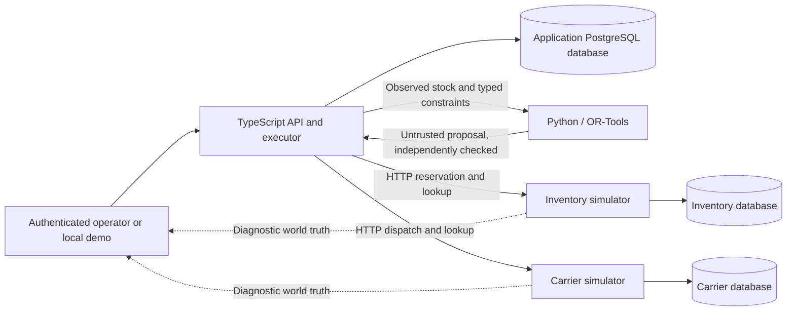

# A decision survives only if its evidence and effects survive

Replan implements one operational workflow: approve a set of critical-parts
transfers, execute them, and recover the remaining work when reality changes.
The difficult boundary is between a local decision and an external commitment.
The application cannot roll back a dispatched shipment with a database rollback.

## Components and trust boundaries



The three services use separate databases on the local PostgreSQL cluster. The
application accesses provider state through HTTP, not cross-database transactions.
Inventory and carrier processes survive an injected application crash. This
separates ownership and persistence, not physical infrastructure: a cluster or
machine outage affects all three. This is not a high-availability deployment.

The planner reads the application's **observed snapshot**. The evaluator view can
show newer simulator stock and actual carrier commitments, but that diagnostic
data is not silently fed into planning. **Refresh** explicitly records a new
observation; existing proposals retain their original snapshots.

The solver is a replaceable proposal generator, not an authority to send actions.
The Node boundary validates its JSON shape and independently checks order
coverage, capacities, deadlines, totals, and evidence versions. Both optimized and
greedy strategies pass through that same boundary and execution path. See
[evaluation](evaluation.md) for the model, objective and benchmark limits.

There is no LLM dependency. Typed inputs and a constrained optimization problem
are sufficient for this workflow. An unstructured-message extractor could be
added later, but its output would still need validation and provenance.

## What is stored

| Store       | Records                                  | Purpose                                                                                      |
| ----------- | ---------------------------------------- | -------------------------------------------------------------------------------------------- |
| Application | `scenario_state`                         | Current operation per workspace, start time, observed inventory and demo crash-control flag  |
| Application | `plans`                                  | Immutable proposal payload, source snapshot, strategy, hash, lifecycle status and timestamps |
| Application | `approvals`                              | Exact plan hash, approval time and authenticated operator ID/name in pilot mode              |
| Application | `actions`                                | Stable action ID, allocation, execution stage and provider receipts                          |
| Application | `events`                                 | Ordered observation, approval, transition and reconciliation evidence                        |
| Inventory   | `inventory_scenarios`, `inventory_stock` | Authoritative stock per warehouse/part and its version                                       |
| Inventory   | `inventory_reservations`                 | Idempotency key, original request, quantity and held/consumed/released state                 |
| Carrier     | `carrier_scenarios`, `carrier_shipments` | Fault controls and committed dispatches with their original requests                         |

Each new scenario has a fresh UUID. **Reset demo** switches the active epoch after
both simulators are initialized; it does not erase old physical-effect records or
old audit events. The UI and export show the current scenario, not a historical
scenario browser.

The application serializes mutations within each workspace with a PostgreSQL session advisory lock held
on a dedicated connection. Workspace lock IDs are allocated by PostgreSQL, not hashed from user input. Separate workspaces can progress independently. A competing operation receives a conflict instead of
interleaving the workflow. A partial unique index also permits only one approved,
executing or uncertain plan per scenario. This remains a small-workload design; it is not a general distributed scheduler.

## Approval binds a concrete decision

A SHA-256 fingerprint covers the scenario ID, strategy, source snapshot and full
solution using canonical JSON. Approval submits the exact displayed fingerprint.
Before execution, the application verifies the fingerprint against the stored
payload, checks the approval record, and checks that action allocations match the
approved solution. Proposed alternatives are superseded when one is approved.

Proposals older than ten minutes cannot be approved. Fresh approval does not make
old stock authoritative: every new reservation still checks the provider's stock
version and available quantity. Execution also checks elapsed scenario time
against the order's repair window before a new reservation and before dispatch.

The fingerprint catches accidental drift within this application's trust model.
It is not a signature, authorization token, tamper-proof log or defense against a
database administrator rewriting all related records. In pilot mode the approval records the provisioned operator UUID and name, and every audit event records the request identity and workspace. Demo mode uses the literal **Demo operator**.

## Execution and recovery

The ordinary action path is:

```text
pending → reserving → reserved → dispatching → dispatched → completed
                                      ↘ dispatch_unknown
```

Before external work, the application persists its intent. Each action has a
stable key derived from the plan ID and action ordinal. Retrying the same action
reuses that key and payload.

Inventory reservation atomically verifies the expected version and sufficient
available stock, subtracts the quantity and creates a held reservation in one
provider transaction. A stale version stops the plan even if enough units happen
to remain. That conservative decision keeps execution attached to the evidence
the operator approved. Earlier successful reservations from the same approved
plan are accounted for when checking subsequent versions of that stock item.

Carrier dispatch commits its record before responding. The lost-response fault
destroys the reply **after commit**. The crash fault terminates the application
**after carrier dispatch and before local confirmation**. Both produce uncertainty
about a real, independently persisted simulator effect.

On startup an interrupted executing plan becomes uncertain. **Check & recover**
queries provider receipts using the original keys. If the carrier confirms a
shipment, Replan records that receipt and finishes inventory bookkeeping without
creating another shipment. If lookup is unavailable or its evidence contradicts
the approved action, the workflow remains uncertain and blocks replacement
approval. Recovery is operator-triggered; there is no background retry worker.

Requests may be attempted more than once. Provider transactions and stable keys
make repeated identical requests idempotent; reusing a key with changed arguments
is rejected. The carrier also rejects a second commitment for an already
dispatched order in the same scenario. These are explicit simulator contracts,
not a claim of exactly-once network delivery or a cross-service transaction.
A real integration must verify equivalent provider guarantees before enabling
automatic retries.

### Absence is not cancellation

A carrier lookup returning 404 establishes only that no record is visible at that
moment. A timed-out dispatch could still commit later. While the route remains
within its deadline, recovery may retry the same approved request with the same
idempotency key. It must not switch to a new key or a new plan to escape ambiguity.

If the repair window expires **before any dispatch attempt**, an uncommitted
reservation can be released and the plan invalidated. If dispatch was already
attempted and the deadline then expires, an absent lookup does not authorize
release: inventory remains held and the plan remains uncertain pending positive
carrier evidence or terminal cancellation. A cancellation request first persists its reason, then asks the carrier to fence the stable action key under the same lock used by creation. If a shipment already committed, the receipt is retained and inventory consumption is reconciled. Only a terminal carrier cancellation permits inventory cancellation/release. Inventory persists its own tombstone, fencing a delayed reservation too.

Every retry after cancellation intent continues cancellation; it cannot resume normal dispatch. A timeout during cancellation keeps the plan uncertain and blocks replacement approval. Completed actions are retained. There is no manual “assume it failed” override. These guarantees are exercised against the simulator implementation; an actual provider must establish the same contract before deployment.

### Replan only what remains

Confirmed transfers are retained. A stale pending action moves the original plan
to `needs_replan`. After a fresh observation, planning excludes completed orders
and subtracts their used lane capacity. The replacement is a new proposal with a
new fingerprint and requires a new approval. The original approval never silently
authorizes a more expensive substitute. **Completed** means the plan's transfers
were dispatched and inventory bookkeeping finished, not that parts arrived or
repairs succeeded.

## Deployment and evidence limits

The default demo accepts loopback Host/Origin values and exposes synthetic fault controls. Pilot mode requires explicit database/provider settings, an exact HTTPS origin and a provider credential. Browser access uses fixed-duration HttpOnly Secure sessions, and the API enforces viewer/operator/admin roles. Operator keys and sessions are stored as hashes; key rotation and revocation invalidate sessions. Provisioning is an administrator CLI, not public signup. This is not SSO or MFA.

The authenticated principal supplies the workspace through request-local context. Current state, plan reads, events and execution locks are workspace scoped. Provider datasets have an immutable workspace owner assigned out of band; an admin cannot import an arbitrary dataset by guessing its UUID. The schema is migrated transactionally under a migration lock, records checksums, and rejects changed migrations or a newer database version. Pilot deployments can verify the schema without granting the application DDL privileges.

Readiness checks the application database and both provider health endpoints. Liveness alone establishes only a responsive process. [The private pilot runbook](pilot-deployment.md) covers TLS ingress, secrets, roles, backup/restore and remaining deployment verification.

The event trail supports inspection and evidence export. It is not event sourcing:
the app does not reconstruct all databases by replaying the event log, and exported
events are not cryptographically tamper-evident. The export verifier checks dispatch evidence and conservation; it does not independently prove provider tombstone permanence. The recovery tests instead restart
real processes and inspect durable application and provider state.

The model has static synthetic lanes, integer-dollar costs, no arrival tracking,
no supplier ingestion, no inventory reservation expiry and no real carrier
connector. Dispatch receipts represent simulated commitments. These boundaries
keep the implemented reliability argument small enough to inspect and test.
