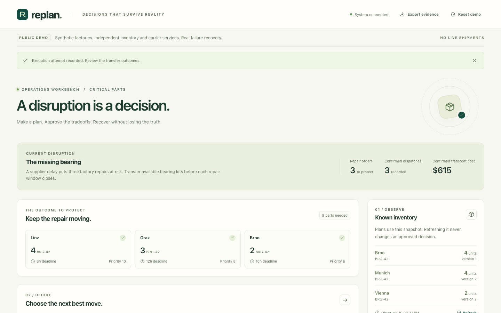

# A timeout is an unresolved decision

A carrier can commit a shipment and lose its response. The calling application
then has neither a confirmed success nor evidence that retrying is safe. A local
database rollback cannot undo the external commitment.

Replan makes that boundary visible in one workflow: approve transfers for three
factory repairs, execute them, and recover when the evidence changes. The
operator's question is **“What can I still safely commit to, given what has
already happened?”**

[Watch the captioned 90-second recording](https://github.com/maximilliangrand/replan/releases/download/v0.2.0/replan-recovery-demo.mp4)
· [Run the application](../README.md#run-it)
· [Inspect the recording's audit](evidence/launch-demo-recovery.json)

The inventory and carrier are independently persisted simulators. This is a
tested engineering case study, with no real shipments or measured customer
benefit. It uses TypeScript/Node, React, PostgreSQL and Python/OR-Tools.

## The failure shown in the recording

| Step           | What changes                                                                                        | What the operator can safely do                                                                          |
| -------------- | --------------------------------------------------------------------------------------------------- | -------------------------------------------------------------------------------------------------------- |
| Approve        | A $440 proposal covers three repair orders.                                                         | Authorize those allocations and their recorded evidence.                                                 |
| Lose the reply | The carrier commits the first transfer, worth $320; the application receives no usable receipt.     | Treat the outcome as unknown, keeping its reservation held.                                              |
| Lose lookup    | The carrier cannot answer reconciliation requests.                                                  | Inspect the hold; a replacement cannot bypass the unresolved commitment.                                 |
| Change stock   | Another consumer takes four units from Vienna.                                                      | Recover the existing first shipment, then stop when the remaining reservation encounters stale evidence. |
| Replan         | The first transfer remains confirmed; a new proposal covers only the two remaining orders for $295. | Review and approve that changed remainder.                                                               |
| Finish         | Three distinct orders have dispatch receipts, costing $320 + $295 = $615.                           | Export the proposal, approvals, transitions and provider records.                                        |

The final cost is higher than the original proposal. Replan exposes the cost of
the disruption instead of silently treating an earlier approval as permission
to spend more. Dispatch remains distinct from delivery. The original plan keeps
its `needs_replan` status as history; the replacement completes the remaining
orders, leaving no unresolved work.



## Decisions that shape the implementation

**An observation is not a reservation.** The planner uses a recorded inventory
snapshot. The authoritative inventory service checks quantity and version
atomically when reserving stock. The demo's evaluator view can show newer facts,
but that information does not secretly improve the planner's input.

**Optimization proposes; approval authorizes.** OR-Tools first maximizes fulfilled
priority, then minimizes cost for that priority. Orders are indivisible. The
TypeScript boundary independently checks the solver's allocations and totals.
Approval binds the exact proposal and evidence with a fingerprint; a changed
remainder is another decision. This fingerprint is an integrity check, not a
digital signature. See the [planning boundary](../src/planner.ts) and
[evaluation assumptions](evaluation.md).

**Record intent before making an external request.** Each action keeps a stable
key and durable execution stage. After interruption, the executor queries the
provider using that identity and records a matching receipt before proceeding.
It does not recreate the whole plan. A successful HTTP exchange is also
insufficient if the returned receipt describes the wrong action. The
[executor](../src/engine.ts) and [adapter validation](../src/providers.ts) enforce
these boundaries.

**Unknown outcomes need an operational path.** When lookup is unavailable,
Replan holds the reservation and blocks replacement approval. A 404 can still
precede a delayed commit, so absence alone cannot justify releasing stock.
Cancellation requires the provider to fence that action key against future
creation; already committed shipments survive cancellation. Those are explicit
provider contracts, not guarantees an HTTP client can manufacture.

## Evidence beyond the recording

The integration tests use actual HTTP services and separate PostgreSQL databases.
[Recovery tests](../tests/recovery.test.ts) kill the application after an external
commit, restart a new process, and inspect provider state. Other tests hold
database locks until after a request times out and lookup returns 404, then let
the original request commit. This exercises the race that a simple “retry on
failure” demonstration would miss.

Pilot mode adds authenticated approvals, viewer/operator/admin permissions,
workspace-scoped imports and audit, secure browser sessions, and a restricted
runtime database role. [HTTP acceptance tests](../tests/pilot.test.ts) exercise
the role and workspace boundaries through the actual server.

The temporary [Railway deployment](railway-acceptance.md) separately exercised
public-CA HTTPS, a lost response, unavailable lookup, an application restart,
monitoring and logical restore. That run finished at **$440**, because it did
not include the recording's inventory disruption. The deployment was
intentionally taken offline after testing on 2026-09-23.

## Reproduce and inspect

Follow the [local setup](../README.md#run-it) and the
[five-minute walkthrough](demo.md). The fault controls are part of the local
demo; they are disabled in authenticated pilot mode.

To check the recording's exported evidence without starting the application,
install the Node dependencies and run:

```sh
npm ci
npm run verify:export -- docs/evidence/launch-demo-recovery.json
```

The verifier checks proposal fingerprints, approvals, dispatch intent, matching
commitments, uniqueness and stock conservation. The export is an unsigned
snapshot: these checks establish consistency, not an independent attestation.

## Deliberate limits and the next useful test

There is one active operation per workspace and a PostgreSQL advisory lock
serializes its mutations. Different workspaces can progress independently. This
keeps the execution protocol inspectable; it is not a general workflow platform
or a claim of unlimited scale. No LLM participates in planning or authorization.

There is no distributed transaction or exactly-once delivery guarantee.
Recovery depends on durable provider idempotency, authoritative reservations and
usable reconciliation evidence. A real carrier may expose label purchase,
handoff and delivery as different commitments; a simulator's cancellation
contract cannot simply be assumed to apply. The
[provider assessment](provider-assessment.md) records those gaps.

The next useful step is an independent repair planner attempting the
[acceptance drill](product-brief.md#an-independent-acceptance-drill), followed by
contract tests against the selected providers. That would test whether the
priorities, approval boundaries and recovery evidence help someone make an
actual decision. No customer pilot or independent operator study is claimed.
